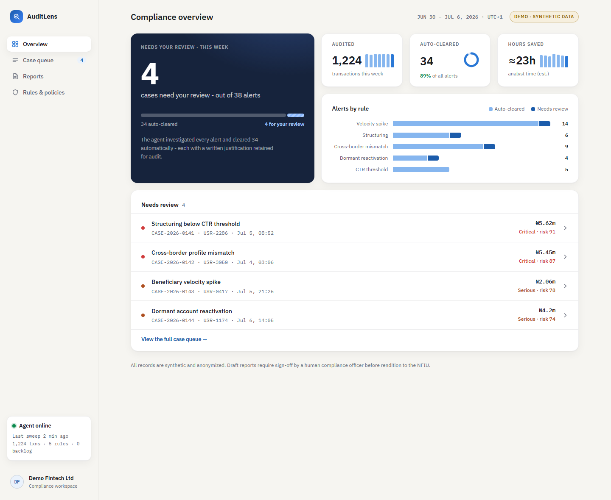
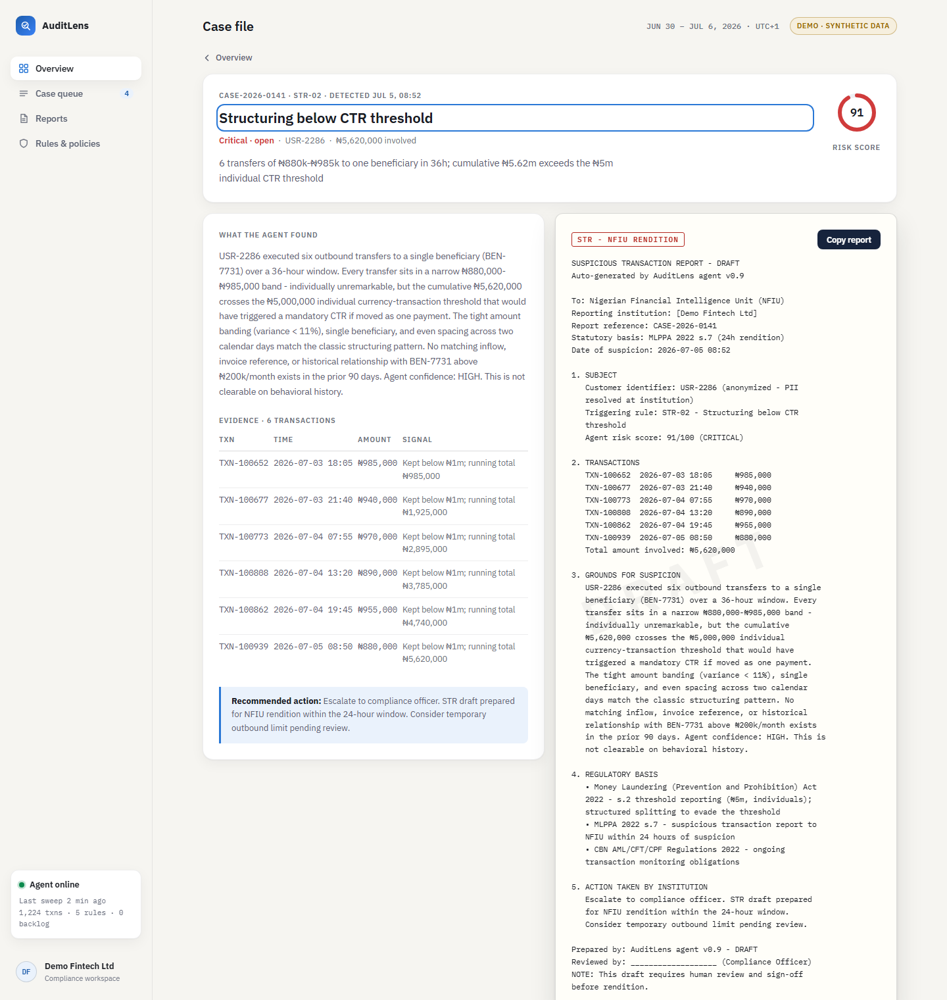

# AuditLens

**Continuous transaction integrity for fintechs.** An autonomous compliance agent
that audits 100% of transactions against AML rules, investigates every alert,
clears the false positives itself - with a written justification retained for
audit - and drafts the regulatory reports for the ones that matter.

> **Status: validation MVP.** This is a smoke-and-mirrors demo built to validate
> the product with compliance professionals. Everything runs client-side on
> synthetic, anonymized data. No production infrastructure exists yet.



## The problem

Fintech compliance teams drown in alert fatigue. Legacy transaction-monitoring
platforms flag thousands of transactions; **over 90% are false positives**, and a
human analyst still has to investigate each one, then spend ~45 minutes drafting a
Suspicious Transaction Report for the few that are real. Sample-based month-end
audits cover a fraction of activity and still consume whole days.

## What AuditLens does differently

Legacy monitoring stops at the raw alert. AuditLens **investigates** it:

- **100% continuous coverage** - every transaction is audited against the
  rulebook, not a 5% month-end sample.
- **The agent clears its own false positives** - each clearance comes with a
  plain-English justification memo, retained as an audit trail (a payday routine
  is recognized as a payday routine, not a velocity alert).
- **One-click regulatory reports** - when a case is real, the agent has already
  drafted the NFIU-ready STR: subject, evidence, grounds for suspicion, statutory
  basis. The compliance officer reviews and signs; nothing is submitted without a
  human.
- **Zero-PII ingestion** - hashed customer and account identifiers only. Names,
  BVNs, and card data never leave the institution.

In the demo week: **1,224 transactions audited → 38 alerts → 34 auto-cleared →
4 cases for human review**, with 4 STR drafts ready to sign and ≈23 analyst-hours
saved.

## The demo

Open **`dashboard.html`** in any browser - it's fully self-contained (no build,
no server, no dependencies; IBM Plex loads from Google Fonts when online and falls
back gracefully offline).

| Screen | What it shows |
|---|---|
| **Overview** | The week's verdict: cases needing review, alert-resolution funnel, coverage stats, alerts by rule. |
| **Case queue** | Open cases and auto-cleared alerts, sortable by risk, recency, or amount. |
| **Reports** | Draft STRs awaiting officer sign-off, plus the auto-filed CTR. |
| **Rules & policies** | The five detection rules with thresholds and per-rule outcomes. |
| **Case file** | Click any case: the agent's justification memo, transaction evidence with running totals, risk score, and the draft STR as a ready-to-print paper document. |



### Detection rules in the demo

| Rule | Pattern |
|---|---|
| `VEL-01` Beneficiary velocity spike | 4+ transfers to first-seen beneficiaries within 30 minutes |
| `STR-02` Structuring below CTR threshold | Repeated sub-₦1m transfers to one beneficiary exceeding ₦5m in 72h (never auto-cleared) |
| `CBM-03` Cross-border profile mismatch | 2+ coinciding signals: IP/KYC country mismatch, new device, weak name match, night-time initiation |
| `DOR-04` Dormant account reactivation | 180+ days dormant, then ₦1m+ outbound within 24h |
| `CTR-05` Currency transaction threshold | Single transactions ≥ ₦5m (individual) / ₦10m (corporate); CTR auto-drafted |

## Repository contents

| Path | What it is |
|---|---|
| `demo/dashboard.html` | The demo - open it directly in a browser. |
| `demo/dashboard_template.html` | Dashboard source with an `__AUDIT_DATA__` placeholder - see build step below. |
| `data/generate_data.py` | Seeded generator for the synthetic dataset and agent findings. |
| `data/transactions.csv` | 1,224 synthetic, anonymized Nigerian fintech transactions with planted violations. |
| `data/audit_findings.json` | The agent's output: alert statistics and six full case files. |
| `docs/agent_prompt.md` | Prompt to reproduce the audit live with an LLM, for "is the AI real?" moments. |
| `docs/DEMO_GUIDE.md` | Talking points, demo walkthrough order, and outreach playbook. |
| `plans/outreach-plan.md` | Validation step 2: target list, messages, interview script, tracking. |
| `screenshots/` | Ready-to-send PNGs of every screen. |

Rebuild the dashboard after changing the data (from the repo root):

```bash
python data/generate_data.py
python -c "import io; d=io.open('data/audit_findings.json',encoding='utf-8').read(); t=io.open('demo/dashboard_template.html',encoding='utf-8').read(); io.open('demo/dashboard.html','w',encoding='utf-8').write(t.replace('__AUDIT_DATA__', d))"
```

## Regulatory context

The demo cites the Nigerian framework: the Money Laundering (Prevention and
Prohibition) Act 2022 (₦5m/₦10m currency-transaction thresholds, 24-hour STR
rendition to the NFIU) and the CBN AML/CFT/CPF Regulations 2022. The same
architecture generalizes to other regimes (FCA, FinCEN) by swapping the policy
layer. **Citations were written for a mockup - have a compliance professional
verify exact sections before relying on them.**

## Disclaimers

- All records are **synthetic**. No real customer, transaction, or institution
  data appears anywhere in this repository.
- "AuditLens" and "Demo Fintech Ltd" are placeholder names.
- This is a validation artifact, not a compliance product. Draft reports require
  human review; nothing here constitutes legal or regulatory advice.
